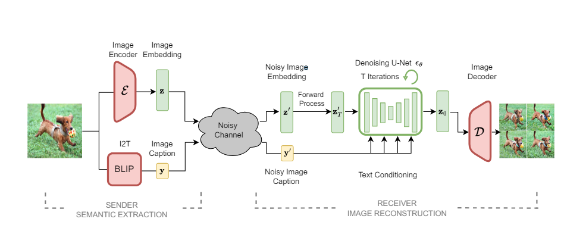
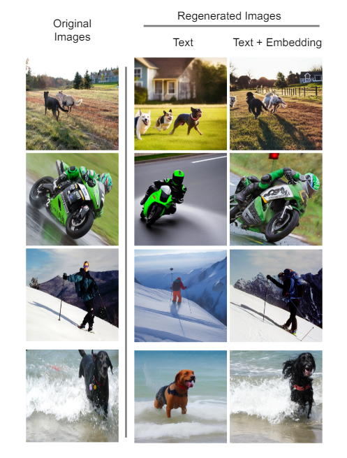
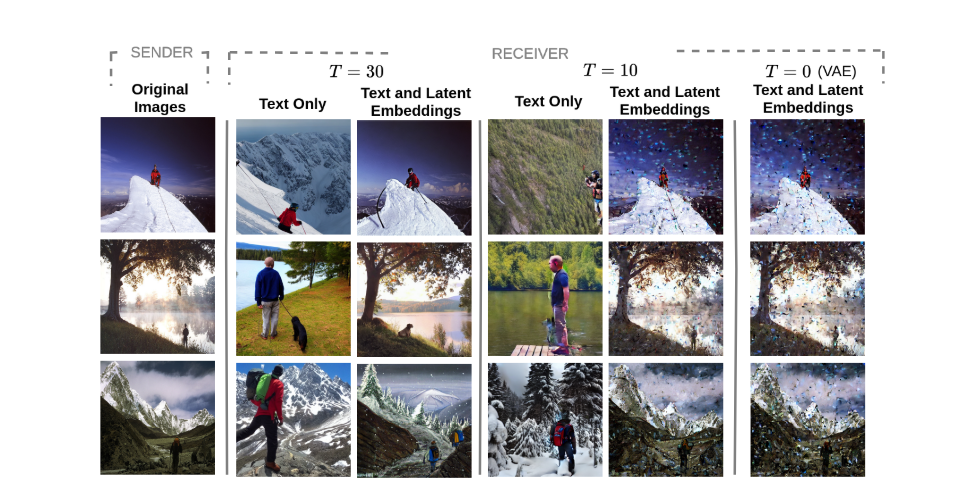

<div align="center">

 

</div>


## Img2Img-SC

This is the official implementation of the paper: [Language-Oriented Semantic Latent Representation for Image Transmission](https://arxiv.org/abs/2405.09976)

## News


**June 17, 2024**  *Code Released*

________________________________
  


## Requirements

Create a dedicated conda environment:
```
conda env -n SemanticI2I python=3.9
conda activate SemanticI2I

```


You can clone the repository by typing:
```

git clone https://github.com/ispamm/Img2Img-SC.git
cd Img2Img-SC

```

You can update an existing [latent diffusion](https://github.com/CompVis/latent-diffusion) environment by running

```
conda install pytorch==1.12.1 torchvision==0.13.1 -c pytorch
pip install transformers==4.19.2 diffusers invisible-watermark
pip install -e .

``` 

After that you can install the remaining required packages by running:


```

pip install -r requirements.txt

```

## Download pretraining models

Download pretrained checkpoints and copy them into the "/checkpoints" folder.

## Img2Img

The scripts are located in the "/scripts" folder.

/scripts/semantic_i2i.py refers to the proposed I2I framework that uses latent embedding and image caption.
/scripts/semantic_t2i.py refers to the  I2I framework that uses only image caption.

For testing the img2img framework, change the model and configuration paths inside script files and then use:

```
python /scripts/semantic_i2i.py

#Or

python /scripts/semantic_t2i.py
```
and adapt the checkpoint and config paths accordingly.

## Results

<div align="center">

 

</div>

<div align="center">

 

</div>

<div align="center">

 

</div>


## License

The code in this repository is released under the MIT License.

## Acknowledgment 

Most of the code contained in this repository is based on Stable diffusion repository https://github.com/Stability-AI/stablediffusion


## BibTeX

```
@misc{cicchetti2024languageoriented,
      title={Language-Oriented Semantic Latent Representation for Image Transmission}, 
      author={Giordano Cicchetti and Eleonora Grassucci and Jihong Park and Jinho Choi and Sergio Barbarossa and Danilo Comminiello},
      year={2024},
      eprint={2405.09976},
      archivePrefix={arXiv},
      primaryClass={id='cs.CV' full_name='Computer Vision and Pattern Recognition' is_active=True alt_name=None in_archive='cs' is_general=False description='Covers image processing, computer vision, pattern recognition, and scene understanding. Roughly includes material in ACM Subject Classes I.2.10, I.4, and I.5.'}
}
```


